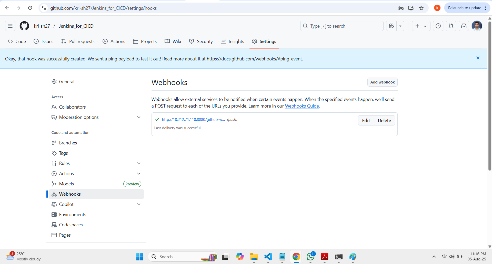
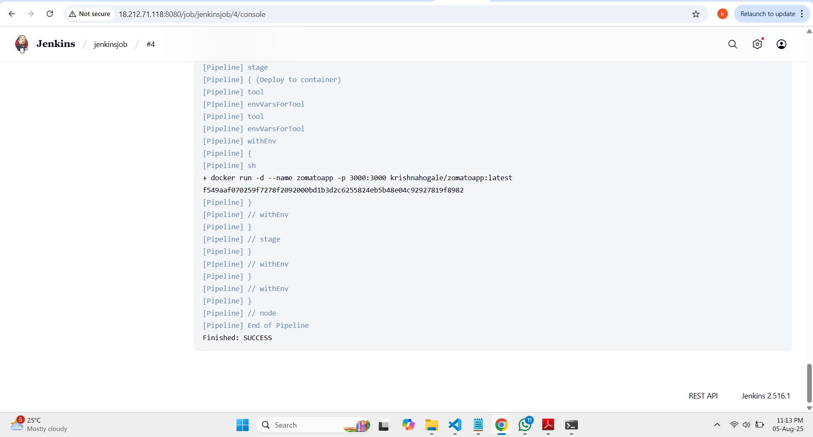

````markdown
# 🚀 Node.js Demo App - CI/CD Pipeline with Jenkins and Docker

This project demonstrates a complete CI/CD pipeline setup using *Jenkins*, *Docker*, and a *self-hosted runner*. The pipeline builds and deploys a Node.js application to Docker Hub and runs it inside a Docker container.
````
## 📁 Project Structure

```bash
.
├── Dockerfile
├── Jenkinsfile
├── src/
│   └── ... (App source code)
├── package.json
└── README.md
```

---

## 🛠️ Step-by-Step Setup

### 1. ✅ Created an Ubuntu Instance and Connected via SSH

```bash
ssh ubuntu@<instance-ip>
```

---

### 2. ✅ Installed Required Tools

#### 📦 Java (Pre-requisite for Jenkins)

```bash
sudo apt update
sudo apt install openjdk-17-jdk -y
```

#### ⚙️ Installed Jenkins

```bash
wget -q -O - https://pkg.jenkins.io/debian-stable/jenkins.io.key | sudo apt-key add -
sudo sh -c 'echo deb https://pkg.jenkins.io/debian-stable binary/ > /etc/apt/sources.list.d/jenkins.list'
sudo apt update
sudo apt install jenkins -y
sudo systemctl start jenkins
sudo systemctl enable jenkins
```

#### 🐳 Installed Docker

```bash
sudo apt install docker.io -y
```

#### 🔓 Fixed Docker Permission Issue

```bash
sudo chmod 777 /var/run/docker.sock
```

---

### 3. ✅ Jenkins Configuration

* Jenkins is accessible at: `http://<instance-ip>:8080`
* Completed Jenkins initial setup
* Installed required plugins:

  * **NodeJS Plugin**
  * **Docker Pipeline Plugin**

---

### 4. ✅ Added Webhook in GitHub

* GitHub → Settings → Webhooks → Added URL:
  `http://<jenkins-ip>:8080/github-webhook/`
  (Triggers build on each push to `main`)

---

### 5. ✅ Added Docker Credentials in Jenkins

* Jenkins → Manage Credentials → DockerHub Credentials
  (ID: `docker`)

---

### 6. ✅ Created Jenkins Pipeline

**Jenkinsfile:**

```groovy
pipeline {
    agent any
    tools {
        jdk 'java17'
        nodejs 'node16'
    }

    stages {
        stage('Clean Workspace') {
            steps {
                cleanWs()
            }
        }

        stage('Checkout from Git') {
            steps {
                git branch: 'main', url: 'https://github.com/kri-sh27/Jenkins_for_CICD.git'
            }
        }

        stage('Install Dependencies') {
            steps {
                sh 'npm install'
            }
        }

        stage('Docker Build & Push') {
            steps {
                script {
                    withDockerRegistry(credentialsId: 'docker', toolName: 'docker') {
                        sh 'docker build -t zomatoapp .'
                        sh 'docker tag zomatoapp krishnahogale/zomatoapp:latest'
                        sh 'docker push krishnahogale/zomatoapp:latest'
                    }
                }
            }
        }

        stage('Deploy to Container') {
            steps {
                sh 'docker run -d --name zomatoapp -p 3000:3000 krishnahogale/zomatoapp:latest'
            }
        }
    }
}
```

---

## 📦 Output

On every code push to `main`:

1. Jenkins is triggered via webhook
2. Code is cloned and dependencies are installed
3. Docker image is built and pushed to DockerHub
4. App is deployed as a running container on port `3000`


<div align="center">
  
</div>

<div align="center">
  
</div>

<div align="center">
  
</div>

---

## 🔐 Jenkins Credentials

| Credential ID | Description           |
| ------------- | --------------------- |
| `docker`      | DockerHub credentials |

---

## ✅ Conclusion

This setup efficiently automates the CI/CD workflow using Jenkins, Docker, and GitHub on a self-hosted runner with webhook-based triggers.

---

## 📎 References

* [Jenkins Documentation](https://www.jenkins.io/doc/)
* [Docker Documentation](https://docs.docker.com/)
* [Node.js](https://nodejs.org/)
* [GitHub Webhooks](https://docs.github.com/en/webhooks)
